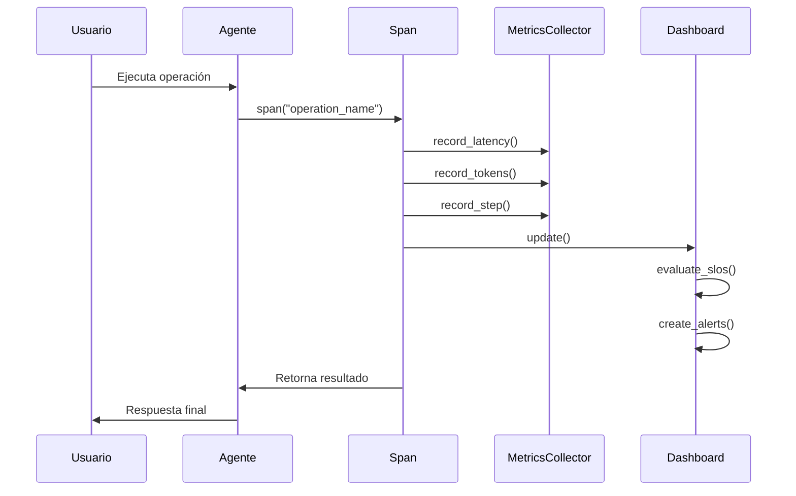
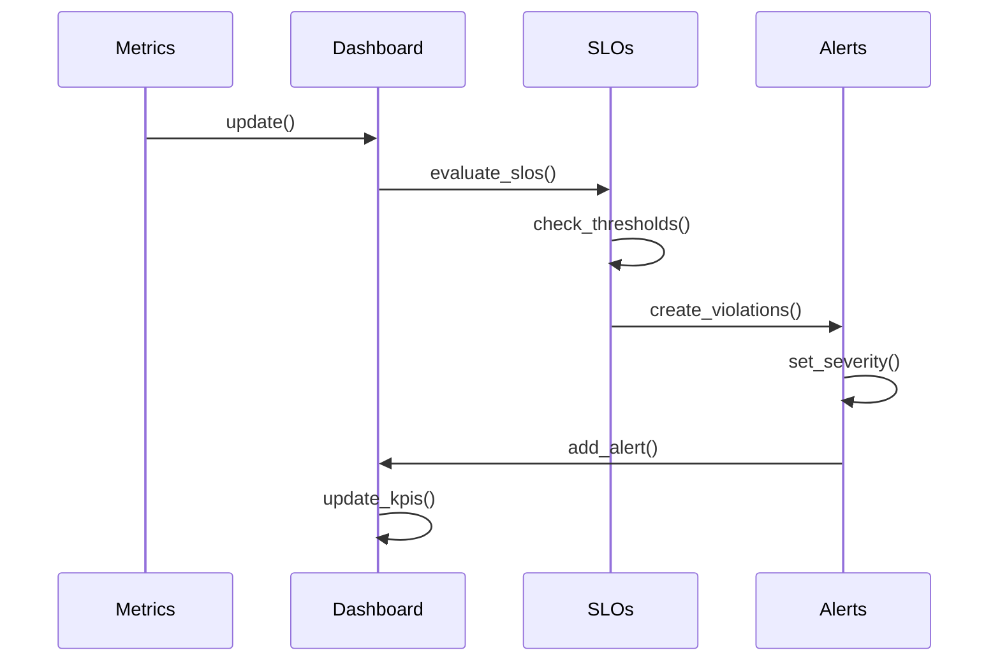
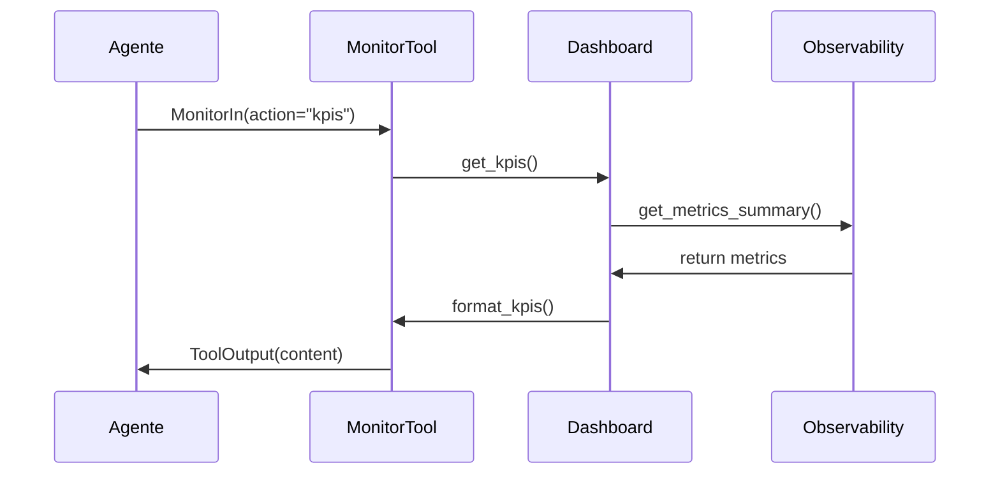

# 🔍 Sistema de Observabilidad Avanzada

## 📋 Tabla de Contenidos

- [🎯 Vista General](#-vista-general)
- [🏗️ Arquitectura del Sistema](#️-arquitectura-del-sistema)
- [📊 Diagrama de Flujo](#-diagrama-de-flujo)
- [🔧 API Reference](#-api-reference)
- [🔄 Flujos Detallados](#-flujos-detallados)
- [💡 Casos de Uso](#-casos-de-uso)
- [🚀 Guía de Implementación](#-guía-de-implementación)
- [🧪 Testing y Validación](#-testing-y-validación)

---

## 🎯 Vista General

El **Sistema de Observabilidad Avanzada** es una implementación completa de métricas, trazabilidad y monitoreo para agentes ReAct basados en LangGraph. Proporciona visibilidad completa del rendimiento, costo y salud del sistema en tiempo real.

### ✨ Características Principales

- **📊 Métricas Avanzadas**: P50/P95/P99 latencia, tokens, costo estimado
- **🔗 Trazabilidad**: Correlation IDs únicos, spans anidados
- **🎯 KPIs en Tiempo Real**: Performance, reliability, efficiency, health
- **🚨 SLOs y Alertas**: Service Level Objectives automáticos
- **🛠️ Herramienta de Monitoreo**: Interfaz programática para métricas
- **📈 Análisis de Tendencias**: Histórico y predicciones básicas

---

## 🏗️ Arquitectura del Sistema

```mermaid
graph TB
    subgraph "Agente ReAct"
        A[Planner] --> B[Reasoner]
        B --> C[Tool Selector]
        C --> D[Tool Executor]
        D --> E[Critic]
        E --> F[Finalizer]
    end
    
    subgraph "Sistema de Observabilidad"
        G[MetricsCollector] --> H[Metrics]
        I[TraceContext] --> J[Span Manager]
        K[MetricsDashboard] --> L[SLOs & Alerts]
        M[MonitorTool] --> N[External APIs]
    end
    
    subgraph "Integración"
        A -.->|span()| G
        B -.->|span()| G
        C -.->|span()| G
        D -.->|span()| G
        E -.->|span()| G
        F -.->|span()| G
        
        G --> K
        I --> J
        J --> G
        K --> M
    end
    
    style G fill:#e1f5fe
    style K fill:#f3e5f5
    style M fill:#e8f5e8
```

### 🔧 Componentes Principales

1. **MetricsCollector**: Recolector centralizado de métricas
2. **TraceContext**: Gestión de trazabilidad y correlation IDs
3. **MetricsDashboard**: Dashboard de KPIs y SLOs
4. **MonitorTool**: Herramienta de monitoreo programático
5. **Span Manager**: Gestión de spans y métricas de operaciones

---

## 📊 Diagrama de Flujo

```mermaid
flowchart TD
    A[Usuario ejecuta agente] --> B[span() inicia]
    B --> C[TraceContext.new_span()]
    C --> D[Record start time]
    D --> E[Execute operation]
    E --> F{Success?}
    
    F -->|Yes| G[Record success metrics]
    F -->|No| H[Record error metrics]
    
    G --> I[Calculate percentiles]
    H --> I
    I --> J[Update dashboard]
    J --> K[Check SLOs]
    K --> L{Any violations?}
    
    L -->|Yes| M[Create alerts]
    L -->|No| N[Update KPIs]
    
    M --> N
    N --> O[Export metrics]
    O --> P[End span]
```

---

## 🔧 API Reference

### 📊 Clase `Metrics`

**Propósito**: Almacena métricas de rendimiento y costo para una operación.

**Atributos**:
```python
class Metrics:
    # Latencia (en milisegundos)
    latency_p50: float = 0.0      # Percentil 50
    latency_p95: float = 0.0      # Percentil 95
    latency_p99: float = 0.0      # Percentil 99
    
    # Tokens y costo
    input_tokens: int = 0          # Tokens de entrada
    output_tokens: int = 0         # Tokens de salida
    total_tokens: int = 0          # Total de tokens
    estimated_cost_usd: float = 0.0 # Costo estimado en USD
    
    # Rendimiento
    total_steps: int = 0           # Total de pasos
    successful_steps: int = 0      # Pasos exitosos
    failed_steps: int = 0          # Pasos fallidos
    tool_calls: int = 0            # Llamadas a herramientas
    tool_success_rate: float = 0.0 # Tasa de éxito de herramientas
    
    # Errores
    error_count: int = 0           # Conteo de errores
    error_rate: float = 0.0        # Tasa de error
    
    # Recursos
    memory_usage_mb: float = 0.0   # Uso de memoria en MB
    cpu_usage_percent: float = 0.0 # Uso de CPU en porcentaje
```

**Ejemplo de uso**:
```python
from src.core.observability import Metrics

# Crear métricas personalizadas
metrics = Metrics(
    latency_p50=100.0,
    total_tokens=500,
    total_steps=10
)

print(f"Latencia P50: {metrics.latency_p50}ms")
print(f"Total tokens: {metrics.total_tokens}")
```

### 🔗 Clase `TraceContext`

**Propósito**: Gestiona el contexto de trazabilidad para correlacionar logs y métricas.

**Atributos**:
```python
class TraceContext:
    trace_id: str                    # ID único de la traza
    span_id: str                     # ID del span actual
    parent_span_id: str | None       # ID del span padre
    user_id: str | None              # ID del usuario
    session_id: str | None           # ID de la sesión
    request_id: str | None           # ID de la request
```

**Métodos**:
```python
def new_span(self) -> "TraceContext":
    """Crea un nuevo span hijo."""
    return TraceContext(
        trace_id=self.trace_id,
        parent_span_id=self.span_id,
        user_id=self.user_id,
        session_id=self.session_id,
        request_id=self.request_id
    )
```

**Ejemplo de uso**:
```python
from src.core.observability import TraceContext

# Crear contexto raíz
root_context = TraceContext()
print(f"Trace ID: {root_context.trace_id}")

# Crear span hijo
child_context = root_context.new_span()
print(f"Parent Span ID: {child_context.parent_span_id}")
```

### 📈 Clase `MetricsCollector`

**Propósito**: Recolector centralizado de métricas del sistema.

**Métodos principales**:
```python
class MetricsCollector:
    def record_latency(self, operation: str, latency_ms: float):
        """Registra latencia de una operación."""
        
    def record_tokens(self, operation: str, input_tokens: int, output_tokens: int):
        """Registra uso de tokens."""
        
    def record_step(self, operation: str, success: bool, tool_call: bool = False):
        """Registra un paso de ejecución."""
        
    def get_summary(self, operation: str = None) -> dict[str, Any]:
        """Obtiene resumen de métricas."""
```

**Ejemplo de uso**:
```python
from src.core.observability import MetricsCollector

collector = MetricsCollector()

# Registrar métricas
collector.record_latency("planner", 150.5)
collector.record_tokens("planner", 100, 50)
collector.record_step("planner", success=True, tool_call=False)

# Obtener resumen
summary = collector.get_summary()
print(f"Operaciones: {len(summary['operations'])}")
```

### 🎯 Clase `SLODefinition`

**Propósito**: Define Service Level Objectives para monitoreo automático.

**Atributos**:
```python
class SLODefinition:
    name: str           # Nombre del SLO
    metric: str         # Métrica a monitorear
    threshold: float    # Umbral objetivo
    operator: str       # Operador (>=, <=, ==, !=)
    severity: str       # Severidad (info, warning, error, critical)
    description: str    # Descripción del SLO
```

**Métodos**:
```python
def evaluate(self, value: float) -> bool:
    """Evalúa si el valor cumple con el SLO."""
    if self.operator == ">=":
        return value >= self.threshold
    elif self.operator == "<=":
        return value <= self.threshold
    elif self.operator == "==":
        return value == self.threshold
    elif self.operator == "!=":
        return value != self.threshold
    return False
```

**Ejemplo de uso**:
```python
from src.core.metrics_dashboard import SLODefinition

# SLO de latencia
latency_slo = SLODefinition(
    "latency_p95",
    "latency_p95",
    5000.0,  # 5 segundos
    "<=",
    "warning",
    "P95 de latencia debe estar bajo 5 segundos"
)

# Evaluar SLO
current_latency = 3000.0
is_compliant = latency_slo.evaluate(current_latency)
print(f"SLO cumplido: {is_compliant}")
```

### 📊 Clase `MetricsDashboard`

**Propósito**: Dashboard principal para visualización y alertas de métricas.

**Métodos principales**:
```python
class MetricsDashboard:
    def add_slo(self, name: str, metric: str, threshold: float, 
                 operator: str = ">=", severity: str = "warning", 
                 description: str = ""):
        """Agrega un nuevo SLO."""
        
    def evaluate_slos(self, metrics: dict[str, Any]) -> list[dict[str, Any]]:
        """Evalúa todos los SLOs contra las métricas actuales."""
        
    def update(self) -> dict[str, Any]:
        """Actualiza el dashboard con métricas frescas."""
        
    def get_kpis(self) -> dict[str, Any]:
        """Obtiene KPIs clave para monitoreo."""
        
    def acknowledge_alert(self, alert_id: str):
        """Marca una alerta como reconocida."""
        
    def export_metrics(self, format: str = "json") -> str:
        """Exporta métricas en diferentes formatos."""
        
    def get_metrics_trend(self, hours: int = 24) -> dict[str, Any]:
        """Obtiene tendencias de métricas en las últimas N horas."""
```

**Ejemplo de uso**:
```python
from src.core.metrics_dashboard import MetricsDashboard

dashboard = MetricsDashboard()

# Agregar SLO personalizado
dashboard.add_slo(
    "custom_latency",
    "latency_p95",
    3000.0,
    "<=",
    "error",
    "Latencia P95 debe estar bajo 3 segundos"
)

# Actualizar dashboard
update_result = dashboard.update()
print(f"Alertas activas: {update_result['dashboard']['active_alerts']}")

# Obtener KPIs
kpis = dashboard.get_kpis()
print(f"Performance: {kpis['performance']}")
```

### 🛠️ Clase `MonitorTool`

**Propósito**: Herramienta de monitoreo que permite al agente consultar métricas programáticamente.

**Atributos**:
```python
class MonitorTool:
    name: str = "monitor"
    description: str = "Monitorea métricas, KPIs y estado del sistema de observabilidad."
    timeout_s: int = 5
```

**Métodos**:
```python
def __call__(self, args: MonitorIn) -> ToolOutput:
    """Ejecuta la acción de monitoreo solicitada."""
    
def _get_kpis(self) -> dict:
    """Obtiene KPIs clave del sistema."""
    
def _get_metrics(self, operation: str = None) -> dict:
    """Obtiene métricas detalladas."""
    
def _get_dashboard(self) -> dict:
    """Obtiene estado completo del dashboard."""
    
def _get_alerts(self) -> dict:
    """Obtiene alertas activas del sistema."""
    
def _get_trends(self, hours: int) -> dict:
    """Obtiene tendencias de métricas."""
```

**Ejemplo de uso**:
```python
from src.tools.monitor import MonitorTool, MonitorIn

monitor = MonitorTool()

# Obtener KPIs
result = monitor(MonitorIn(action="kpis", format="summary"))
print(f"KPIs: {result.content}")

# Obtener métricas de una operación específica
result = monitor(MonitorIn(action="metrics", operation="planner"))
print(f"Métricas del planner: {result.content}")

# Obtener alertas
result = monitor(MonitorIn(action="alerts"))
print(f"Alertas: {result.content}")
```

---

## 🔄 Flujos Detallados

### 📊 Flujo de Métricas Básicas



**Ejemplo de código**:
```python
from src.core.observability import span, get_metrics_summary

def mi_operacion():
    with span("mi_operacion") as span_ctx:
        # Tu lógica aquí
        resultado = hacer_algo()
        
        # Las métricas se registran automáticamente
        return resultado

# Ejecutar y ver métricas
mi_operacion()
metrics = get_metrics_summary()
print(f"Operaciones: {metrics['operations']}")
```

### 🎯 Flujo de SLOs y Alertas



**Ejemplo de código**:
```python
from src.core.metrics_dashboard import update_dashboard, get_kpis

# Actualizar dashboard (evalúa SLOs automáticamente)
dashboard_update = update_dashboard()

# Verificar violaciones
violations = dashboard_update['violations']
if violations:
    print(f"⚠️ {len(violations)} SLOs violados:")
    for violation in violations:
        print(f"  - {violation['slo_name']}: {violation['message']}")

# Obtener KPIs actualizados
kpis = get_kpis()
print(f"Health score: {kpis['health']}")
```

### 🔍 Flujo de Monitoreo Programático



**Ejemplo de código**:
```python
from src.tools.monitor import MonitorTool, MonitorIn

# El agente puede monitorear su propio estado
monitor = MonitorTool()

# Verificar KPIs
kpis_result = monitor(MonitorIn(action="kpis"))
if kpis_result.ok:
    kpis = kpis_result.content
    if kpis['health']['active_alerts'] > 0:
        print("⚠️ Hay alertas activas en el sistema")
    
    if kpis['performance']['latency_p95_ms'] > 5000:
        print("🐌 La latencia P95 está alta")
```

---

## 💡 Casos de Uso

### 🚀 Caso 1: Monitoreo de Agente ReAct

**Escenario**: Quieres monitorear el rendimiento de tu agente ReAct en tiempo real.

**Implementación**:
```python
from src.core.observability import span, get_metrics_summary
from src.core.metrics_dashboard import get_kpis

def agente_react():
    with span("react_episode") as episode_span:
        # Planificación
        with span("planner"):
            plan = crear_plan()
        
        # Razonamiento
        with span("reasoner"):
            razonamiento = analizar_situacion()
        
        # Ejecución de herramientas
        with span("tool_executor"):
            resultado = ejecutar_herramienta()
        
        # Crítica
        with span("critic"):
            evaluacion = evaluar_resultado()
        
        return resultado

# Ejecutar agente
resultado = agente_react()

# Ver métricas inmediatamente
metrics = get_metrics_summary()
kpis = get_kpis()

print("📊 Rendimiento del Agente:")
print(f"  Latencia P95: {kpis['performance']['latency_p95_ms']:.1f}ms")
print(f"  Tasa de éxito: {kpis['reliability']['success_rate']*100:.1f}%")
print(f"  Costo estimado: ${kpis['efficiency']['estimated_cost_usd']:.4f}")
```

### 🎯 Caso 2: Alertas Automáticas de SLOs

**Escenario**: Quieres recibir alertas cuando el sistema no cumple con los objetivos de calidad.

**Implementación**:
```python
from src.core.metrics_dashboard import MetricsDashboard, update_dashboard

# Configurar SLOs personalizados
dashboard = MetricsDashboard()

# SLO de latencia crítica
dashboard.add_slo(
    "latencia_critica",
    "latency_p95",
    2000.0,  # 2 segundos
    "<=",
    "critical",
    "Latencia P95 crítica - debe estar bajo 2 segundos"
)

# SLO de tasa de éxito
dashboard.add_slo(
    "tasa_exito_minima",
    "tool_success_rate",
    0.95,  # 95%
    ">=",
    "error",
    "Tasa de éxito mínima del 95%"
)

# Monitorear continuamente
def monitorear_slos():
    while True:
        update_result = update_dashboard()
        
        # Verificar alertas críticas
        for alert in update_result['recent_alerts']:
            if alert['severity'] == 'critical':
                print(f"🚨 ALERTA CRÍTICA: {alert['message']}")
                # Aquí podrías enviar notificación por email/Slack
        
        time.sleep(60)  # Verificar cada minuto

# Iniciar monitoreo en background
import threading
monitor_thread = threading.Thread(target=monitorear_slos, daemon=True)
monitor_thread.start()
```

### 📈 Caso 3: Análisis de Tendencias

**Escenario**: Quieres analizar cómo evoluciona el rendimiento del sistema a lo largo del tiempo.

**Implementación**:
```python
from src.core.metrics_dashboard import get_dashboard
from datetime import datetime, timedelta

def analizar_tendencias():
    dashboard = get_dashboard()
    
    # Tendencias de las últimas 24 horas
    trends_24h = dashboard.get_metrics_trend(24)
    
    print("📈 Tendencias (24h):")
    for metric, data in trends_24h['trends'].items():
        trend = data['trend']
        avg = data['avg']
        
        if trend == 'increasing':
            emoji = "📈"
        elif trend == 'decreasing':
            emoji = "📉"
        else:
            emoji = "➡️"
        
        print(f"  {emoji} {metric}: {avg:.2f} ({trend})")
    
    # Tendencias de la última semana
    trends_week = dashboard.get_metrics_trend(168)  # 7 * 24 horas
    
    print("\n📊 Tendencias (1 semana):")
    for metric, data in trends_week['trends'].items():
        print(f"  {metric}: {data['trend']} (promedio: {data['avg']:.2f})")

# Ejecutar análisis
analizar_tendencias()
```

### 🛠️ Caso 4: Integración con Herramientas Externas

**Escenario**: Quieres exportar métricas a sistemas de monitoreo externos como Grafana o Prometheus.

**Implementación**:
```python
from src.core.metrics_dashboard import get_dashboard
import json
import requests

def exportar_a_prometheus():
    """Exporta métricas en formato Prometheus."""
    dashboard = get_dashboard()
    metrics = dashboard.get_metrics_summary()
    
    prometheus_metrics = []
    
    # Métricas globales
    global_metrics = metrics['global_metrics']
    prometheus_metrics.append(f"# HELP total_steps Total steps executed")
    prometheus_metrics.append(f"# TYPE total_steps counter")
    prometheus_metrics.append(f"total_steps {global_metrics['total_steps']}")
    
    prometheus_metrics.append(f"# HELP total_tokens Total tokens used")
    prometheus_metrics.append(f"# TYPE total_tokens counter")
    prometheus_metrics.append(f"total_tokens {global_metrics['total_tokens']}")
    
    prometheus_metrics.append(f"# HELP estimated_cost_usd Estimated cost in USD")
    prometheus_metrics.append(f"# TYPE estimated_cost_usd gauge")
    prometheus_metrics.append(f"estimated_cost_usd {global_metrics['estimated_cost_usd']}")
    
    # Métricas por operación
    for op_name, op_metrics in metrics['operations'].items():
        prometheus_metrics.append(f"# HELP operation_latency_p95 Latency P95 by operation")
        prometheus_metrics.append(f"# TYPE operation_latency_p95 gauge")
        prometheus_metrics.append(f'operation_latency_p95{{operation="{op_name}"}} {op_metrics["latency_p95"]}')
    
    return "\n".join(prometheus_metrics)

def exportar_a_grafana():
    """Exporta métricas a Grafana via API."""
    dashboard = get_dashboard()
    kpis = dashboard.get_kpis()
    
    # Preparar datos para Grafana
    grafana_data = {
        "time": datetime.now().isoformat(),
        "performance": kpis['performance'],
        "reliability": kpis['reliability'],
        "efficiency": kpis['efficiency'],
        "health": kpis['health']
    }
    
    # Enviar a Grafana (ejemplo)
    # response = requests.post(
    #     "http://grafana:3000/api/datasources/proxy/1/write",
    #     json=grafana_data
    # )
    
    return grafana_data

# Exportar métricas
prometheus_metrics = exportar_a_prometheus()
print("📊 Métricas Prometheus:")
print(prometheus_metrics)

grafana_data = exportar_a_grafana()
print("\n📈 Datos para Grafana:")
print(json.dumps(grafana_data, indent=2))
```

---

## 🚀 Guía de Implementación

### 📦 Instalación

```bash
# Instalar dependencias
pip install -e ".[dev]"

# Verificar instalación
python -c "from src.core.observability import span; print('✅ Observabilidad instalada')"
```

### 🔧 Configuración Básica

```python
# 1. Importar componentes principales
from src.core.observability import span, get_metrics_summary, reset_metrics
from src.core.metrics_dashboard import get_kpis, update_dashboard
from src.tools.monitor import MonitorTool, MonitorIn

# 2. Resetear métricas para empezar limpio
reset_metrics()

# 3. Usar span() para monitorear operaciones
with span("mi_operacion"):
    # Tu código aquí
    resultado = hacer_algo()
    
# 4. Ver métricas inmediatamente
metrics = get_metrics_summary()
print(f"Operaciones monitoreadas: {len(metrics['operations'])}")
```

### 🎯 Configuración Avanzada

```python
from src.core.metrics_dashboard import MetricsDashboard

# Crear dashboard personalizado
dashboard = MetricsDashboard()

# Agregar SLOs personalizados
dashboard.add_slo(
    "mi_slo_critico",
    "latency_p95",
    1000.0,  # 1 segundo
    "<=",
    "critical",
    "Latencia crítica para mi aplicación"
)

# Configurar alertas personalizadas
def mi_callback_alertas(violations):
    for violation in violations:
        if violation['severity'] == 'critical':
            print(f"🚨 CRÍTICO: {violation['message']}")
            # Enviar notificación inmediata

# Integrar con el dashboard
dashboard.violation_callback = mi_callback_alertas
```

### 🔄 Integración con Agentes ReAct

```python
from src.core.observability import span, track_metrics
from src.react.loop import react_loop

# Opción 1: Usar span() manualmente
def mi_agente_react():
    with span("react_episode"):
        # Tu lógica ReAct aquí
        pass

# Opción 2: Usar decorador @track_metrics
@track_metrics("mi_agente")
def mi_agente_react():
    # Tu lógica ReAct aquí
    pass

# Opción 3: Integrar con LangGraph
from src.adapters.langgraph_builder import compile_graph

# El sistema de observabilidad se integra automáticamente
graph = compile_graph(mode="static")
```

---

## 🧪 Testing y Validación

### ✅ Tests Unitarios

```python
import pytest
from src.core.observability import Metrics, TraceContext, MetricsCollector

def test_metrics_initialization():
    """Test de inicialización de métricas."""
    metrics = Metrics()
    assert metrics.latency_p50 == 0.0
    assert metrics.total_steps == 0

def test_trace_context():
    """Test de contexto de trazabilidad."""
    context = TraceContext()
    assert context.trace_id is not None
    assert context.span_id is not None

def test_metrics_collector():
    """Test del recolector de métricas."""
    collector = MetricsCollector()
    collector.record_latency("test", 100.0)
    collector.record_step("test", success=True)
    
    summary = collector.get_summary()
    assert "test" in summary["operations"]
```

### 🔍 Tests de Integración

```python
def test_full_observability_flow():
    """Test del flujo completo de observabilidad."""
    
    # 1. Ejecutar operaciones con spans
    with span("test_operation_1"):
        pass
    
    with span("test_operation_2"):
        pass
    
    # 2. Obtener métricas
    summary = get_metrics_summary()
    assert len(summary["operations"]) == 2
    
    # 3. Actualizar dashboard
    dashboard_update = update_dashboard()
    assert "dashboard" in dashboard_update
    
    # 4. Obtener KPIs
    kpis = get_kpis()
    assert "performance" in kpis
    assert "reliability" in kpis
```

### 🚀 Tests de Rendimiento

```python
import time
from src.core.observability import span

def test_performance_overhead():
    """Test del overhead de rendimiento del sistema de observabilidad."""
    
    # Sin observabilidad
    start = time.time()
    for _ in range(1000):
        pass
    time_without = time.time() - start
    
    # Con observabilidad
    start = time.time()
    for _ in range(1000):
        with span("test"):
            pass
    time_with = time.time() - start
    
    # El overhead debe ser mínimo (< 1ms por operación)
    overhead_per_op = (time_with - time_without) / 1000
    assert overhead_per_op < 0.001  # < 1ms
```

---

## 📚 Recursos Adicionales

### 🔗 Enlaces Útiles

- [Documentación de Pre-commit](https://pre-commit.com/)
- [Documentación de Ruff](https://docs.astral.sh/ruff/)
- [Google Docstring Style Guide](https://google.github.io/styleguide/pyguide.html#38-comments-and-docstrings)
- [Mermaid Diagram Syntax](https://mermaid.js.org/syntax/flowchart.html)

### 📖 Lecturas Recomendadas

1. **"Observability Engineering"** - Charity Majors
2. **"Site Reliability Engineering"** - Google
3. **"Monitoring Distributed Systems"** - Brendan Gregg

### 🛠️ Herramientas Relacionadas

- **Grafana**: Visualización de métricas
- **Prometheus**: Almacenamiento de métricas
- **Jaeger**: Trazabilidad distribuida
- **ELK Stack**: Logging y análisis

---

## 🤝 Contribución

Para contribuir al sistema de observabilidad:

1. **Fork** el repositorio
2. **Crea** una rama para tu feature
3. **Implementa** tus cambios
4. **Añade** tests
5. **Ejecuta** pre-commit hooks
6. **Envía** un pull request

### 📋 Checklist de Contribución

- [ ] Código sigue las convenciones del proyecto
- [ ] Tests pasan (`python -m pytest`)
- [ ] Pre-commit hooks pasan (`pre-commit run --all-files`)
- [ ] Documentación actualizada
- [ ] Changelog actualizado

---

## 📄 Licencia

Este proyecto está bajo la licencia MIT. Ver [LICENSE](../LICENSE) para más detalles.

---

*Última actualización: Agosto 2024*
*Versión del documento: 1.0.0*
